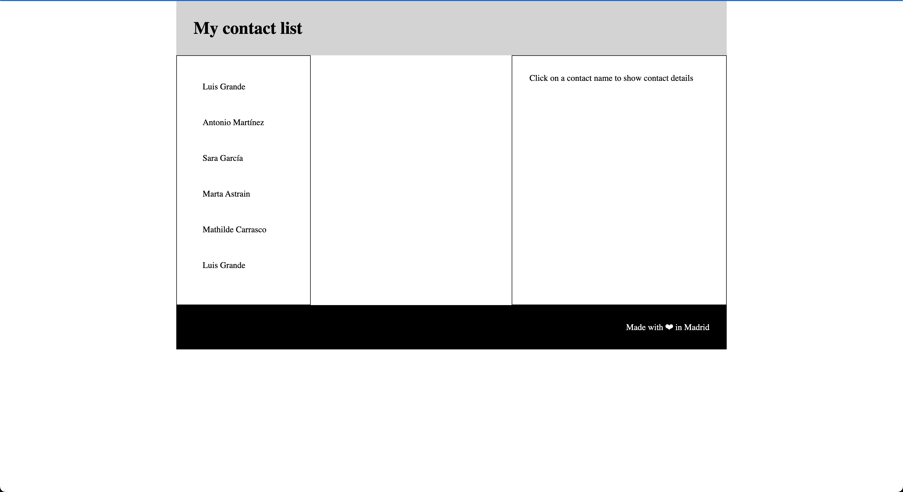
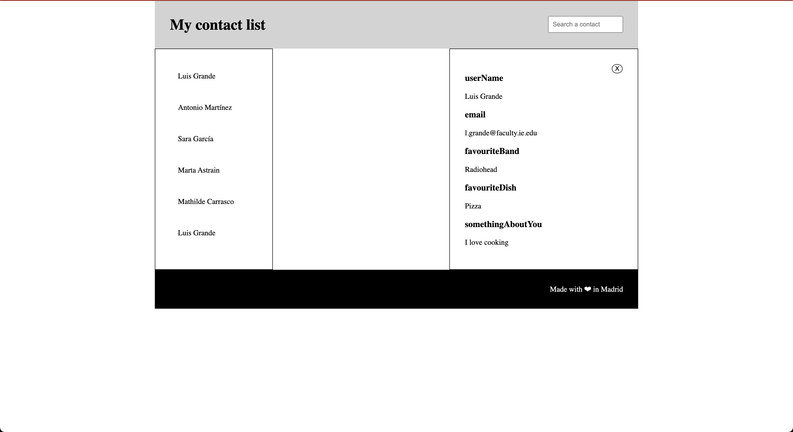
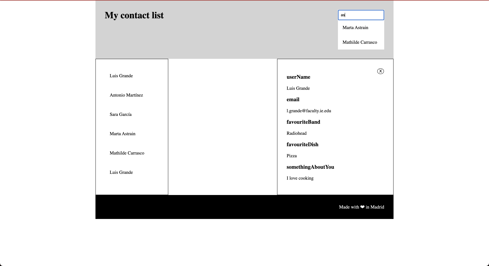

# Contact list exercise
For this exercise we are going to create a website for a contact list.

In this session we are going to focus on CSS to apply what we have learnt about the box model.

There is a Javascript file with some functionalities. It's very similar to session 6 exercise but feel free to ask any question if you don't understand some parts.

The HTML is already done for you, so we will focus in completing the CSS file to add styles to our contact list.

## Part 1

We are going to use CSS to do a basic layout like this in the following image:

1.- In the html add, load the stylesheet contact-list.css

2.- In the html add, load the script contact-list.js

3.- Assign to the .main selector a max-width and center the container horizontally

4.- Using flex, give styles to the following class selectors:

.main

.header

.contact-list

.contact-details

5.- Add background-color and color properties to .header, .footer (choose the colors you prefer)

## Part 2

Now that we have our basic layout we are going to add a close button to the contact-details container. The HTML is already in place, so we will focus on the CSS.

The behaviour we are looking for is the following:

- When we have the detail of a contact rendered, we want to show the close button on the top right of the container.

- When we have no contact details rendered, we want the close button to not show.

1.- Let's look in our HTML the class selector for the close button and let's hide it by default (Hint: we can do that playing with the displat property)

2.- If you look in the javascript file, in line 42 we are adding a class to the contact-details container (contact-details--with-content) indicating that there is content in the container. Use nested selectors (Hint: .my-selector .another-selector {...my properties}) to set the display property to block for the button selector when the contact-details container has the corresponding class (contact-details--with-content)

3.- Using position porperties and top, right properties, show the close button on the upper right corner of the contact-details container

## Part 3

For the last part of this exercise we are going to give styles to a contact search input

1.- set the display property to block for the header__search class (we are doing this because is set to none in the contact-list-basic CSS stylesheet)

2.- Using flex and margin (Hint: play with setting horizontal margins to the search container to auto) style the header so the title is in the left and the search container is in the right of the header container

3.- Using position property, make the list of contacts that is shown below the search input to not make the header grow.
